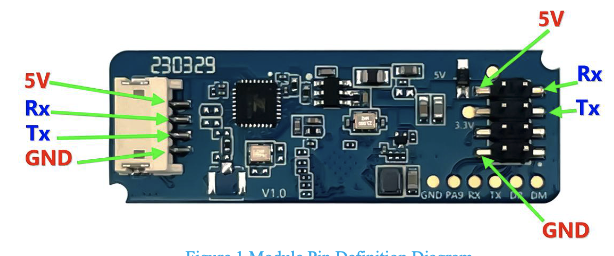

# LD2450

The **HLK-LD2450** is a 24GHz millimeter-wave (mmWave) radar sensor used for car positioning in this project.

## Sensor Capabilities

- Detects up to 3 targets simultaneously with X/Y coordinate tracking
- Centimeter-level accuracy (±1mm)
- UART communication at 256000 baud
- Range up to 6+ meters
- Operates reliably in garage conditions (temperature swings, dust, humidity, exhaust fumes)

## Why mmWave Over Ultrasonic

| Factor | Ultrasonic (HC-SR04) | mmWave (LD2450) |
| ---- | ---- | ---- |
| Accuracy | ±3mm | ±1mm |
| Range | 2cm - 4m | Up to 6m+ |
| Temperature Sensitivity | High (sound speed varies) | Minimal |
| Humidity/Dust | Affected | Unaffected |
| Multi-target Tracking | No | Yes (up to 3) |

## Dual Sensor Configuration

This project uses **two LD2450 sensors** to determine car position:

- **Front Sensor** (`ld2450_front`) — Wall-mounted on the garage-door wall; Y = distance from front wall into garage, X = lateral offset
- **Rear Sensor** (`ld2450_rear`) — Ceiling-mounted above the parked car; Y = distance from ceiling to car top, X = lateral offset

The firmware combines readings from both sensors to detect the car and determine whether it is correctly parked.

## Sensor Placement

### Front Sensor (`ld2450_front`)

- **Wall-mounted** on the front wall of the garage (the wall the garage door is in)
- Faces inward toward the parked car; Y axis = depth into garage, X axis = lateral offset
- Accuracy: ±1-2 cm distance, ±3-5 cm position

### Rear Sensor (`ld2450_rear`)

- **Ceiling-mounted** above the parked car, further from the garage door
- Faces downward; Y axis = vertical distance from ceiling to car top, X axis = lateral offset
- Height of 2-3 meters is ideal
- Mount antenna face down; connector side toward the ceiling
- Point straight down, or angle slightly toward the incoming car
- Accuracy: ±2-3 cm distance, ±5-10 cm position

### Placement Diagram

```text
      +-----------------------------------------------------------+
      |                    GARAGE (Top-Down View)                 |
      |                                                           |
      |           (Rear Sensor - CEILING MOUNTED)                 |
      |                                                           |
      |    +---------------------------------------------------+  |
      |    |                    Car Here                       |  |
      |    +---------------------------------------------------+  |
      |                                                           |
      |           (Front Sensor - WALL MOUNTED)                   |
      |                                                           |
      +===========================================================+
                         (Garage Door Opening)
```

### Key Placement Considerations

- **Clear line of sight** — Both sensors need an unobstructed view of the car
- **Front Sensor position** — Mount on the garage-door wall; do not mount on the ceiling near the door, as the door panels occupy that space when open
- **Rear Sensor position** — Mount on the ceiling roughly above where the car body will sit when parked; avoid the area near the door opening
- **Target zone calibration** — Adjust `front_target_y_min`/`front_target_y_max`, `rear_target_y_min`/`rear_target_y_max`, and `*_x_tolerance` substitutions based on actual sensor positions

## Person Detection

The LD2450 can detect people in addition to vehicles:

- **Stationary presence** — Detects someone standing still or sitting in a car
- **Multi-target tracking** — Tracks up to 3 targets simultaneously (car + people)
- **X/Y coordinates** — Each target reports position, enabling zone-based detection

### Multi-Target Tracking

The LD2450 reports up to 3 targets, ordered by signal strength (typically size):

| Target | Typical Object | Use Case |
| ---- | ---- | ---- |
| Target 1 | Car (largest) | Primary vehicle positioning |
| Target 2 | Person | Danger zone detection |
| Target 3 | Second person or pet | Additional safety monitoring |

Each target provides:

- **X position** — Horizontal offset from sensor centerline (mm)
- **Y position** — Distance along sensor axis (mm)
- **Distance** — Direct line distance to target (mm)
- **Speed** — Movement velocity (cm/s)

### Danger Zone Detection

The firmware monitors Target 2 from both Front and Rear Sensors to detect people in the path of the vehicle:

```text
      +-----------------------------------------------------------+
      |                    GARAGE (Top-Down View)                 |
      |                                                           |
      |           (Rear Sensor) ← monitors BEHIND car             |
      |                  ↓                                        |
      |          [DANGER ZONE - REAR]                             |
      |    +---------------------------------------------------+  |
      |    |                    Car Here                       |  |
      |    +---------------------------------------------------+  |
      |          [DANGER ZONE - FRONT]                            |
      |                  ↑                                        |
      |           (Front Sensor) ← monitors IN FRONT of car       |
      |                                                           |
      +===========================================================+
```

**Safety behavior:**

- When car is detected (Target 1 valid) AND person detected (Target 2 valid within danger distance)
- LED strip flashes red with "Person Alert" effect
- Parking guidance shows `!!! STOP - PERSON !!!`

**Use cases:**

- Warn driver if someone is behind the car while backing in
- Alert if someone is in front of the car while pulling forward
- Alert if a child or pet enters the parking area
- Safety interlock before closing garage door

### ESPHome Configuration

The danger zone is configured via substitutions:

```yaml
substitutions:
  # Max distance (mm) from sensor where person triggers alert
  danger_zone_distance: "3000"
```

Target 2 sensors are defined for each LD2450:

```yaml
- platform: ld2450
  ld2450_id: ld2450_front
  target_2:
    distance:
      id: front_t2_distance
    x:
      id: front_t2_x
    y:
      id: front_t2_y
```

See `esphome/packages/car-sensor.yaml` for the complete implementation.

## Hardware Details

I used the JMT HLK-LD2450 24GHz Trajectory Sensor ISM


Which has the The 1.5mmx4Pin Female connector

1.5mmx4Pin Female (Customizable)

## Black Pin Header

| LEFT | RIGHT |
| ----- | ---- |
| 5V | RX |
| NC | TX |
| NC | NC |
| GND | NC |

### Header Pins

The 1.5mm is not common.

[JST ZH 1.5mm 4Pin Connector with 200mm](https://www.amazon.com/dp/B0DQZP5QD9)

| Wire | Pin | Function |
| ---- | ---- | ----- |
| BLACK | 5V | Power supply input 5V |
| RED | Rx | Serial port Rx pin |
| WHITE | Tx | Serial port Tx pin |
| YELLOW | GND | Power ground |

## Documentation

[HLK-LD2450](LD2450%20serial%20port%20communication%20protocol%20V1.03.pdf)

## HLKRadar Tool

Both BAUD Rates are 256000

- HLK-LD2450_1A63 is Rear Sensor

## End-to-End Wiring Map

Wire path: **ESP32 J3/J1 header → 7-wire cable → Connector Board → brown 5-wire cable → LD2450**

Wire color format: `[ESP header end]-[cable/connector]-[sensor end]`

> **Note:** The ESP32-C6 board physically labels GPIO16 as `TX` and GPIO17 as `RX` (UART0 USB-bridge labels). In this project GPIO16 is used as the *receive* pin (sensor TX → GPIO16). Follow GPIO numbers, not board labels.

### Front LD2450 (Wall-mounted, garage-door wall)

Wire path includes:

- ESP32 →
- 7-wire cable
- → Rear Connector Board
- → brown 5-wire cable
- → Rear LD2450 Mount

| Function | LD2450 Pin | Wire Colors | ESP J3 Screw | GPIO |
| --- | --- | --- | --- | --- |
| Power | 5V | BLK-BLU-RED | J1 Pin 14 | 5V |
| Ground | GND | YEL-YEL-GRN | J1 Pin 15 | GND |
| **Data out** | **TX** | **WHT-WHT-BLU** ⚠️ verify | J3 Pin 2 | **GPIO16** |
| Config in | RX | RED-ORG-YEL | J3 Pin 3 | GPIO17 |

### Rear LD2450 (Ceiling-mounted)

Wire path includes:

- ESP32 →
- 5-wire cable
- → Rear Connector Board
- → brown 5-wire cable
- → Rear LD2450 Mount

| Function | LD2450 Pin | Wire Colors | ESP J3 Screw | GPIO |
| --- | --- | --- | --- | --- |
| Power | 5V | BLK-BLU-RED | J1 Pin 14 | 5V |
| Ground | GND | YEL-YEL-GRN | J1 Pin 15 | GND |
| **Data out** | **TX** | **WHT-WHT-BLU** ⚠️ verify | J3 Pin 10 | **GPIO18** |
| Config in | RX | RED-ORG-YEL | J3 Pin 9 | GPIO19 |

### ⚠️ Known Inconsistency — TX Wire Colors

Two sources disagree on the TX wire color for both sensors:

| Sensor | LD2450 table | ESP DevKit J3 table |
| --- | --- | --- |
| Front TX (GPIO16) | `WHT-WHT-BLU` | `PUR-WHT-WHT` |
| Rear TX (GPIO18) | `WHT-WHT-BLU` | `BLU-WHT-WHT` |

**The TX wire is the critical data path** — trace it physically from the sensor TX pin to the ESP header and update this table with confirmed colors.
